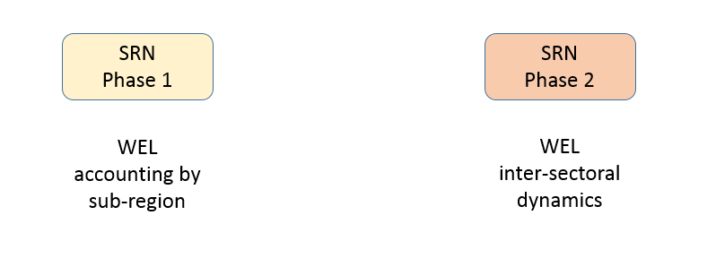

# Table of Contents

* [Introduction](#Introduction)
* [Work Plan](#Work Plan)
* [Modeling Framework](#Modeling Framework)


# <a name="Introduction"></a>Introduction

The overall goal of the SRN model is develop a framework to analyze dynamics across multiple sectors including water, energy, land and socio-economics at various spatial and temporal scales.Key features and additional guides for the model are listed below:

- The Sub-Regional Nexus (SRN) modeling development platform is hosted on github at: https://github.com/zarrarkhan/srn
- The address to clone this repo is: https://github.com/zarrarkhan/srn.git
- The model is comprised of an R package and additional files with sample data
- The R package can be installed from within R from this github site using the following code:
```r
install.packages("devtools");library(devtools)
install_github(repo="zarrarkhan/srn")
library(srn)
```
- Once installed the "srn.master.R"" file can be opened from the downloaded diretory to start analysis
- The following guides are available for further guidance:
    i. This README.md file at https://github.com/zarrarkhan/srn 
    ii. The R package user manual "srn.pdf" in the home directory "srn" after cloning or downloading. This is automatically created during the package build and contains an index of all the functions with brief descriptions and dependencies.
    iii. The vignette inside srn/doc/srn.vignette.html. The vignette examples for each function.

# <a name="Work Plan"></a>Work Plan
The work plan is divided into two phases as described in Table 1 and Figure 1 below. The plan for Phase 1 is to develop a multi-sector accounting tool which can be used to visualize and analyze the demands, supplies and distribution of various resources across multiple sectors at flexible sub-regional scales. The tools in this phase will be designed to be flexible and with an aim to allow interactions with multiple stakeholders and other models. In Phase 2 of the model development links between the different sectors and sub-regions will be developed to allow analyis of cross-sector dynamics. Further details on each Phase are described in the corresponding sectionss.  

<p align="center">
**Table 1: SRN Phases**  
</p>

| Phase |Components       |Description            |Proposed Deadline | Status  |
| :------:|:---------------:|:--------------------:|:-----------------:|:--------:|
| 1     | srn.readgcam.R  | Read and format GCAM data | 7 Dec 2018       | Under development |
| 1     | srn.chart.R     |  Produce charts and diff plots | 7 Dec 2018  |Under development |
| 1     | srn.grid2poly.R |   Create polygon tables from grid | 7 Dec 2018 | Under development |
| 1     | srn.maps.R      |   Create maps | 7 Dec 2018 | Under development |

<p align="center"> **Figure 1: SRN Phases** </p>
<p align="center"> </p>

<p align="center"> **Figure 2: SRN Phase 1 Structure** </p>
<p align="center"> </p>

# <a name="Modeling Framework"></a>Modeling Framework

The model is hosted on github and is comprised of an R Package which comes with sample data. The R package has several different functions. Each function is described in the 
